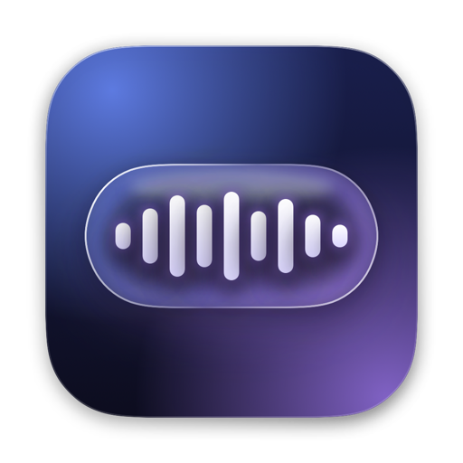
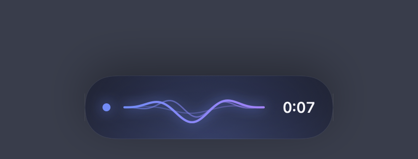
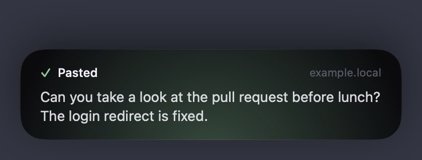
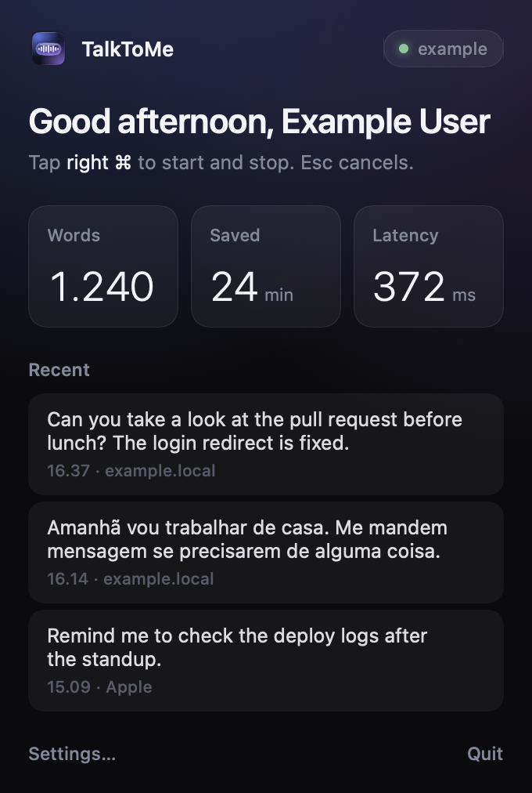

<p align="center"></p>

# TalkToMe

Push-to-talk dictation for macOS. Tap a key, talk, tap again: your words are
pasted where the cursor is. Transcription runs on your Mac, or on a server you
control. No account, no subscription, no cloud unless you point it at one.

<p align="center">
  
  
</p>

<p align="center">
  
</p>

## Features

- **One key.** Tap right ⌘ to start and stop, or hold it while you talk. Esc
  cancels. Right ⌥, right ⌃ or fn work too.
- **Pastes at the cursor** in any app, and always copies to the clipboard.
- **Three ways to transcribe:**
  - **On this Mac:** Apple's on-device speech model. Zero setup, nothing leaves the Mac.
  - **Your own server:** `talktome-server` runs NVIDIA Parakeet on any Apple
    Silicon Mac on your network. Well under half a second per sentence, and it detects 25 languages on its own.
  - **Any OpenAI-compatible endpoint:** anything that implements
    `POST /v1/audio/transcriptions`.
- **Automatic fallback** to on-device transcription when the server is
  asleep or you are away from home.
- **Small and dependency-free:** the app uses only Apple frameworks.

## Requirements

| Part | Needs |
|---|---|
| App | macOS 26 or later. To build from source: Xcode 26+ and [XcodeGen](https://github.com/yonaskolb/XcodeGen) |
| Server (optional) | A Mac with Apple Silicon, Python 3.10+ |

## Quick start

### 1. Install the app

Download `TalkToMe-<version>.dmg` from
[Releases](https://github.com/freibergergarcia/talktome/releases), open it and
drag TalkToMe onto Applications.

The download is not notarized by Apple yet, so the first launch is blocked
with "Apple could not verify TalkToMe". To allow it: open **System Settings →
Privacy & Security**, scroll to **Security**, click **Open Anyway** next to
TalkToMe, and confirm. You only do this once per version.

Or build it from source:

```sh
brew install xcodegen
git clone https://github.com/freibergergarcia/talktome && cd talktome/app
./install.sh            # builds, installs to /Applications, launches
```

TalkToMe sits in the menu bar (a waveform icon) and in the Dock while it runs;
clicking either opens its panel. Prefer menu bar only? Turn off Settings → Show in
Dock. On first use macOS asks for:

| Permission | Why |
|---|---|
| Input Monitoring | To notice the dictation key while you work in other apps |
| Microphone | To record while you dictate |
| Accessibility | To paste with ⌘V into the app you are using (optional; turn off "Paste at the cursor" to skip) |

Out of the box it transcribes on-device. That's it: tap right ⌘ and talk.

### 2. Optional: run your own server

Skip this if you transcribe on-device or already have a compatible service
(step 3). On the Mac that will do the transcribing (it can be the same Mac):

```sh
python3 -m venv ~/.local/share/talktome-server/venv
~/.local/share/talktome-server/venv/bin/pip install \
  "talktome-server[mlx] @ git+https://github.com/freibergergarcia/talktome@v0.2.0#subdirectory=server"
~/.local/share/talktome-server/venv/bin/talktome-server install-agent --host 0.0.0.0
~/.local/share/talktome-server/venv/bin/talktome-server token     # copy this
```

`install-agent` starts the server now and at every login. The first start
downloads the model (about 2.5 GB). Without `--host` the server only accepts
connections from its own machine.

Then in TalkToMe → **Settings… → Transcription**: choose **Server**, enter
`http://<server-name>.local:8766/v1`, paste the token, and press **Test connection**.
Plain HTTP suits a trusted home network; on shared networks put the server
behind HTTPS (see [SECURITY.md](SECURITY.md)). Updating, deploying over SSH
and the macOS firewall: see [server/README.md](server/README.md#install).

### 3. Optional: use another OpenAI-compatible service

No server install needed: TalkToMe works with any service that implements
OpenAI's `POST /v1/audio/transcriptions` and answers with JSON containing a
`text` field. Choose **Server**, enter the provider's base URL (ending in
`/v1`), its API key, and the model name it expects. Check your provider's
documentation for the model name. Audio goes only to the URL you enter.

## How it works

TalkToMe records while you dictate, sends 16 kHz audio to the engine you
choose, and pastes the text at the cursor.

| Engine | Typical latency | Languages | Where audio goes |
|---|---|---|---|
| On this Mac | ~0.2–0.5 s | One at a time, chosen in Settings | Nowhere |
| talktome-server (Parakeet v3) | ~0.3–0.4 s over home Wi-Fi | 25 European languages, auto-detected | Your server |
| OpenAI-compatible | Depends on provider | Depends on provider | The URL you set |

### talktome-server and parakeet-mlx

Since 0.2.0 the server runs Parakeet with its own inference code, written from
NVIDIA's reference implementation (NeMo) and checked against it, instead of
the parakeet-mlx library. Measured on a Mac Studio (M5 Max):

| | parakeet-mlx 0.5.3 | talktome-server 0.2.0 |
|---|---|---|
| Transcripts identical to NVIDIA's (3,539 clips) | 73% | 100% |
| Error rate, short clips (English / Portuguese) | 2.16% / 4.92% | 2.16% / 4.95% |
| Error rate, 5-minute recordings | 1.33% | 0.75% |
| Time for a 10 s clip | 68 ms | 40 ms |
| Time for a 60 s clip | 311 ms | 199 ms |
| GPU memory | Grows without limit | 3.9 GB at most |

Method, the differences and why the server stopped using parakeet-mlx:
[server/README.md](server/README.md#why-not-parakeet-mlx).

## Privacy

- Transcripts are never written to disk by TalkToMe or `talktome-server`.
  The app keeps the last 20 in memory for the "Recent" list; quitting clears them.
- Only counts (words, dictations, timings) are saved, for the stats tiles.
- The server logs the length and loudness of each clip, never its content.
- The optional debug log records key presses and timings, never text.

See [SECURITY.md](SECURITY.md) for the network model.

## Troubleshooting

| Symptom | Likely cause |
|---|---|
| "Didn't catch that" every time | The mic records silence. With the lid closed the built-in mic is off: pick another input in Settings → Microphone |
| "No microphone found" | Mac Studio and Mac mini have no built-in mic. Connect a USB or Bluetooth mic (or AirPods) to that Mac |
| Nothing happens on the key | Input Monitoring is not granted. System Settings → Privacy & Security → Input Monitoring |
| Text is copied but not pasted | Accessibility is not granted, or "Paste at the cursor" is off |
| Server works locally but not from another Mac | Firewall, see [server/README.md](server/README.md#firewall) |
| "requires the use of a secure connection" | macOS only allows plain HTTP to local addresses (`.local`, private IPs). Use HTTPS for anything else |

Turn on **Settings → Advanced → Debug log** and check `~/Library/Logs/TalkToMe.log`.

## Development

See [CONTRIBUTING.md](CONTRIBUTING.md). In short:

```sh
cd app && xcodegen generate && xcodebuild -scheme TalkToMe test
cd server && pip install -e '.[dev]' && pytest && ruff check .
```

## Credits

- [Parakeet TDT 0.6B v3](https://huggingface.co/nvidia/parakeet-tdt-0.6b-v3) by NVIDIA (CC-BY-4.0), with weights converted to MLX format by [mlx-community](https://huggingface.co/mlx-community/parakeet-tdt-0.6b-v3).
- [NVIDIA NeMo](https://github.com/NVIDIA/NeMo) (Apache-2.0): talktome-server's Parakeet code follows its reference implementation.
- [MLX](https://github.com/ml-explore/mlx) by Apple (MIT) runs the encoder on the GPU.

## License

[MIT](LICENSE)
